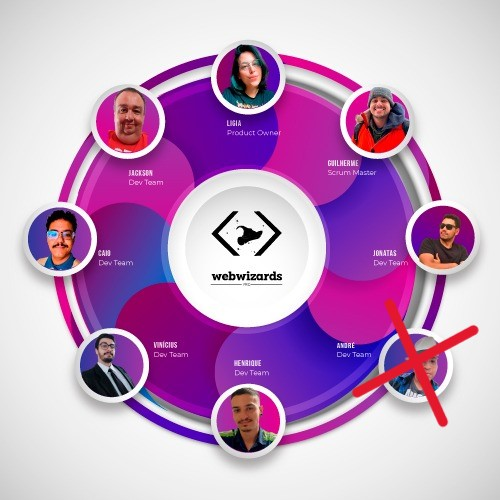

<h1>
 WebWizzardsPro-Visona-Documentação
</h1>

<h2>
 Sobre o Projeto : 
</h2>

O projeto é um sistema online para ajudar na organização de projetos de mapeamento de terrenos. Ele permite delimitar áreas, distribuir tarefas, revisar os mapas feitos e mostrar estatísticas sobre o progresso. 

<h2> Entregas de Sprints </h2>

Cada entrega foi realizada a partir da data definida com o cliente, com o relatório completo do que foi desenvolvido nas sprints. Abaixo está a relação das sprints:

| Sprint | Previsão de Entrega | Status | Histórico |
| ------ | -------------------- | ------ | --------- |
|   1    | 📅 99/99/2024        | :hourglass: Pendente | [:round_pushpin: Ver Relatório](./Sprint01.md  ) |
|   2    | 📅 99/99/2024       | :white_check_mark: Finalizada | [:round_pushpin: Ver Relatório](./Sprint02.md) |
|   3    | 📅 99/99/2024       | :construction: Em Progresso | [:round_pushpin: Ver Relatório](./Sprint03.md) |

Legenda:
- :white_check_mark: **Finalizada**
- :construction: **Em Progresso**
- :hourglass: **Pendente**

<h2>

 Link do portal :

</h2>
****************  link do portal !!!  *****************

<h2>

 Tecnologias :

</h2>

 

  
  
  <a href="https://www.typescriptlang.org/">
  <a>
  
  
  
  

<h2>
 Nossa quipe :
</h2>
 
**Função: Project Owner**
- **Nome:** Ligia Ribeiro
- **Links:** [GitHub](https://github.com/ligribeiro) | [LinkedIn](https://www.linkedin.com/in/liribeiro/)

**Função: Scrum Master**
- **Nome:** Guilherme Carvalho
- **Links:** [GitHub](https://github.com/cGuilhermec) | [LinkedIn](https://www.linkedin.com/in/guilherme-carvalho-1b8b08156/)

**Função: Dev Team**
- **Nome:** André de Holanda Ventura
- **Links:** [GitHub](https://github.com/AndreHVentura) | [LinkedIn](https://www.linkedin.com/in/andrehventura/)

**Função: Dev Team**
- **Nome:** Jonatas Filipe Carvalho Ferreira
- **Links:** [GitHub](https://github.com/filipejonatas) | [LinkedIn](https://www.linkedin.com/in/jonatas-filipe-aa4534165/)

**Função: Dev Team**
- **Nome:** Henrique Pintor de Melo
- **Links:** [GitHub](https://github.com/HenriquePmelo) | [LinkedIn](https://www.linkedin.com/in/henrique-pintor-92448a28b/)

**Função: Dev Team**
- **Nome:** Vinicius Barbosa Fernandes
- **Links:** [GitHub](https://github.com/Viniciusfernandes2) | [LinkedIn](https://www.linkedin.com/in/vinicius-fernandes-6088a323b)

**Função: Dev Team**
- **Nome:** Jackson Rodrigo Costa Machado
- **Links:** [GitHub](https://github.com/jacksonrcmachado) | [LinkedIn](https://www.linkedin.com/in/jackson-rodrigo-costa-machado-b636a84a/)

**Função: Dev Team**
- **Nome:** Caio Cesar Silva Azevedo dos Reis
- **Links:** [GitHub](https://github.com/CaiooAzevedoo) | [LinkedIn](https://www.linkedin.com/in/caio-azevedo-dev/)

