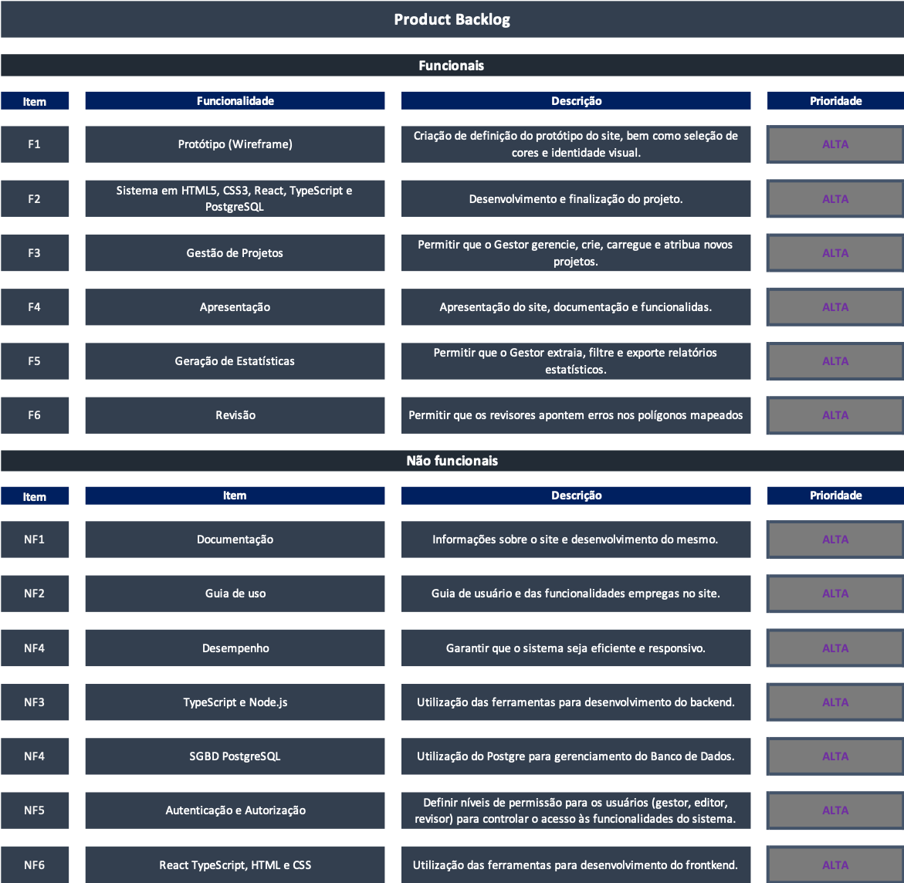

<h1>
 WebWizzardsPro-Visona-Documentação
</h1>

 

<a  href="#sobre">Sobre o Projeto</a> |
<a  href="#backlogs">Product Backlog</a> |
<a  href="#sprint">Entrega de Sprints</a> |
<a  href="#tecnologias">Tecnologias</a> |
<a  href="#equipe">Nossa Equipe</a>

  
 

<h2>
 Sobre o Projeto : 
</h2>

O Sistema de Gestão de Mapeamento Colaborativo é um projeto desenvolvido pela equipe WebWizzards-pro em parceria com a empresa Visiona, que solicitou o desenvolvimento da plataforma. O objetivo deste sistema é fornecer uma plataforma web que simplifique o processo de mapeamento de uso e ocupação da terra para empresas do setor de geotecnologias.

Principais Funcionalidades:

- Cadastro de projetos e usuários (editores e revisores).
- Delimitação de áreas de projeto e atribuição de áreas de trabalho aos usuários.
- Carregamento de polígonos e grade de polígonos para mapeamento.
- Geração de estatísticas de mapeamento, correções e qualidade.
- Filtragem e exportação de relatórios em PDF.

Este sistema visa atender à necessidade da empresa que realiza projetos de geoprocessamento e geoinformação, proporcionando uma maneira eficiente e colaborativa de realizar mapeamentos de forma precisa e organizada. 

 

##### [🔝 Voltar ao topo ](#topo)

<h2 id="sprint">
 Entregas de Sprints :
</h2>

Cada entrega foi realizada a partir da data definida com o cliente, com o relatório completo do que foi desenvolvido nas sprints. Abaixo está a relação das sprints:

| Sprint | Previsão de Entrega | Status | Histórico |
| ------ | -------------------- | ------ | --------- |
|   1    | 📅 17/04/2024        | :white_check_mark: Finalizada | [:round_pushpin: Ver Relatório](./Sprint01.md  ) |
|   2    | 📅 99/99/2024       | :hourglass: Pendente |                                                  |
|   3    | 📅 99/99/2024       | :hourglass: Pendente |                                                   |

Legenda:
- :white_check_mark: **Finalizada**
- :construction: **Em Progresso**
- :hourglass: **Pendente**

 

##### [🔝 Voltar ao topo ](#topo)

<h2>
 Product Backlog :
</h2>
  

  

 

##### [🔝 Voltar ao topo ](#topo)

<h2>
 Requisitos do Cliente :
</h2>
<a href="./Requisitos de Cliente 2DSM - 2024-1.pdf" >  Requisitos de Cliente 2DSM - 2024-1.pdf</a>

 <h3> Requisitos funcionais :</h3>
  
- Carregar o polígono de delimitação da área do projeto.
- Carregar a grade de polígonos, especificando suas dimensões.
- Cadastrar editores e revisores.
- Definir a área de trabalho dos usuários.
- Gerar estatísticas: número de polígonos, área total, correções realizadas.
- Filtrar estatísticas por revisor e período.
- Gerar estatísticas por editor: quantidade de polígonos mapeados, correções, área mapeada.
- Visualizar e exportar relatórios em PDF.
  
<h3>Requisitos não funcionais :</h3>

- Documentação no GitHub com detalhes do projeto, sprint, tecnologias utilizadas e equipe.
- Utilização do Trello para gerenciar o backlog do produto, com integração ao GitHub.
- Tecnologias:
Back-end: TypeScript e Node.js.
Front-end: React TypeScript, HTML, CSS.
- Armazenamento: PostgreSQL.
- Autenticação de usuário.

 

##### [🔝 Voltar ao topo ](#topo)

<h2>

 Tecnologias :

</h2>

 

    

<a href="">
  

 

##### [🔝 Voltar ao topo ](#topo)

<h2>
  
 Nossa quipe :
</h2>

| Função          | Nome                          | Links                                                                                                                         |
|-----------------|-------------------------------|-------------------------------------------------------------------------------------------------------------------------------|
| Project Owner   | Ligia Ribeiro                 |   |
| Scrum Master    | Guilherme Carvalho            |   |
| Dev Team        | Jonatas Filipe Carvalho Ferreira |   |
| Dev Team        | Henrique Pintor de Melo       |   |
| Dev Team        | Vinicius Barbosa Fernandes    |   |
| Dev Team        | Jackson Rodrigo Costa Machado |   |
| Dev Team        | Caio Cesar Silva Azevedo dos Reis |   |
| Dev Team        | Gustavo Carvalho              |   |

 

##### [🔝 Voltar ao topo ](#topo)
