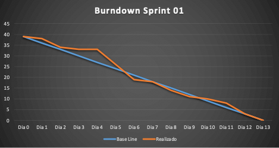
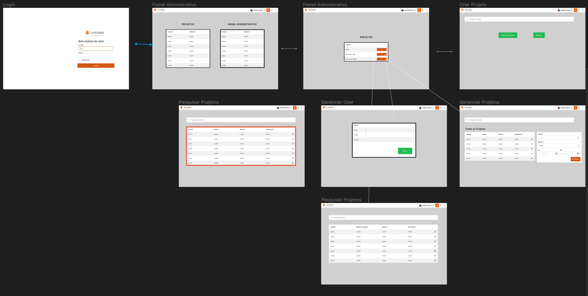
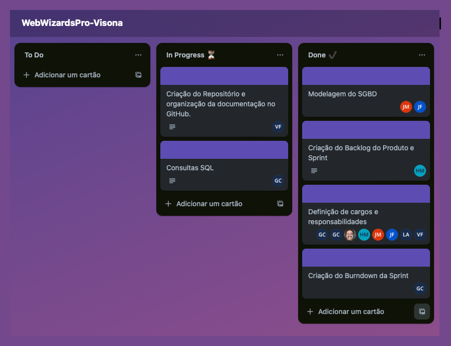

 

### 📍 Sprint 01 📍

## 🗓️ //2023 à 17/04/24 🗓️

 
<a  href="#dart-objetivo-da-sprint">Objetivo da Sprint</a> | 
<a  href="#triangular_flag_on_post-sprint-backlog">Backlog da Sprint</a> | 
<a  href="#page_facing_up-wireframe">Wireframe</a> | 
<a  href="#clipboard-kanbam-trello">Kanbam</a> | 
<a  href="#sprint-r">Sprint Review</a>

### 

#### [ 🏚️ Voltar para home](./README.md)

 
#  🤝 Objetivo da Sprint

 
- Os objetivos desta sprint foram centrados na entrega do Wireframe ao cliente, modelagem do banco de dados, elaboração da documentação e distribuição de tarefas.

# 🚧 Sprint Backlog

 

 
 

  
 
##### [🔝 Voltar ao topo ](#dart-objetivo-da-sprint)
 
# 📇 Burndown Sprint 01
Nesta sprint o time se uniu para as entregas de cada item listado na backlog da sprint.

Abaixo se encontra o gráfico Burndown gerado pela equipe nesta sprint, onde o eixo X são os dias trabalhados e o eixo Y representa as entregas de cada dia:

 

##### [🔝 Voltar ao topo ](#dart-objetivo-da-sprint)

# 📝 Wireframe

 

##### [🔝 Voltar ao topo ](#dart-objetivo-da-sprint)

# 📝 Mer-SGBD

 

##### [🔝 Voltar ao topo ](#dart-objetivo-da-sprint)

# 📝 Kanbam (Trello)

 

 
 

##### [🔝 Voltar ao topo ](#dart-objetivo-da-sprint)

# 🎬 Sprint Review

<h3>O que funcionou bem ? </h3>
 
- Organização da Equipe Utilizando o Discord para Melhor Visualização e Troca de Informações;
- Realizar tarefas em prazo estipulado ;
- Progresso da Documentação, Wireframe e Implementação do Banco de Dados;

<h3>Pontos a melhorar !</h3>

- Faltas nas Reuniões devido a Ausência de Parte da Equipe por Doença;

##### [🔝 Voltar ao topo ](#dart-objetivo-da-sprint)
