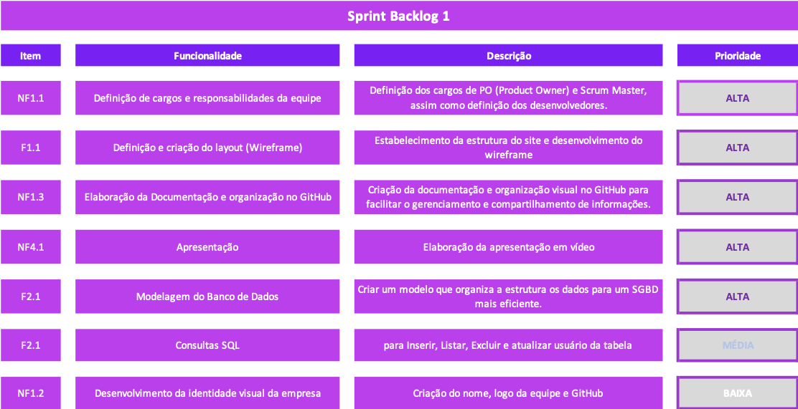
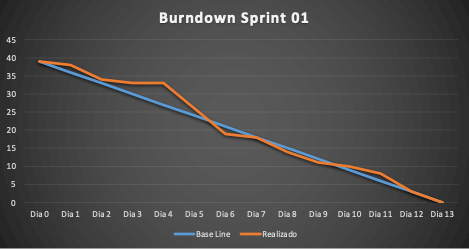
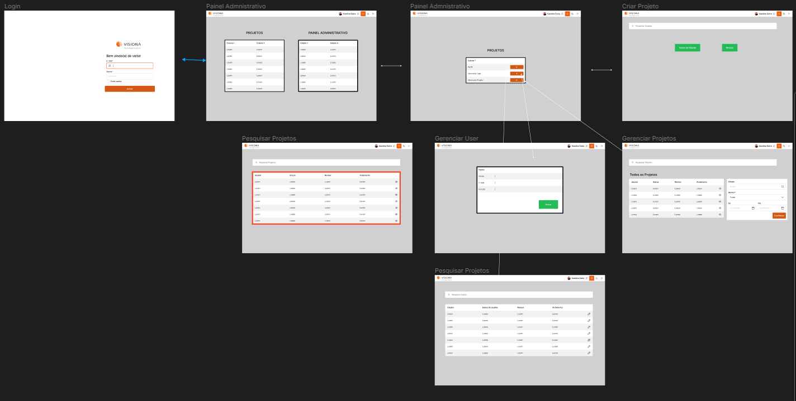
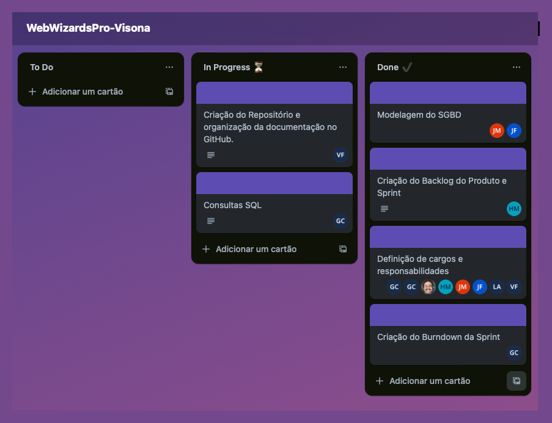

 

### 📠Sprint 01 ğŸ“

## ğŸ—“ï¸ //2023 à 17/04/24 🗓ï¸

 
<a  href="#dart-objetivo-da-sprint">Objetivo da Sprint</a> | 
<a  href="#sprint-backlog">Backlog da Sprint</a> | 
<a  href="#wireframe">Wireframe</a> | 
<a  href="#mer">Modelagem SGBD</a> | 
<a  href="#kanban">Kanban</a> | 
<a  href="#sprint-r">Sprint Review</a>

### 

#### [ ğŸšï¸ Voltar para home](./README.md)

 
#  🤠Objetivo da Sprint

 
- Os objetivos desta sprint foram centrados na entrega do Wireframe ao cliente, modelagem do banco de dados, elaboração da documentação e distribuição de tarefas.

# 🚧 Sprint Backlog

     

  
 
##### [🔠Voltar ao topo ](#topo)
 
# 📇 Burndown Sprint 01
Nesta sprint o time se uniu para as entregas de cada item listado na backlog da sprint.

Abaixo se encontra o gráfico Burndown gerado pela equipe nesta sprint, onde o eixo X são os dias trabalhados e o eixo Y representa as entregas de cada dia:

    

##### [🔠Voltar ao topo ](#topo)

# 📠Wireframe

 

##### [🔠Voltar ao topo ](#topo)

# 📠Modelagem do SGBD

    

 

##### [🔠Voltar ao topo ](#topo)

# 📠Kanban (Trello)

 

     
 

##### [🔠Voltar ao topo ](#topo)

# 🬠Sprint Review

<h3>O que funcionou bem ? </h3>
 
- Organização da Equipe Utilizando o Discord para Melhor Visualização e Troca de Informações;
- Realizar tarefas em prazo estipulado ;
- Progresso da Documentação, Wireframe e Implementação do Banco de Dados;

<h3>Pontos a melhorar !</h3>

- Faltas nas Reuniões devido a Ausência de Parte da Equipe por Doença;

##### [🔠Voltar ao topo ](#topo)
