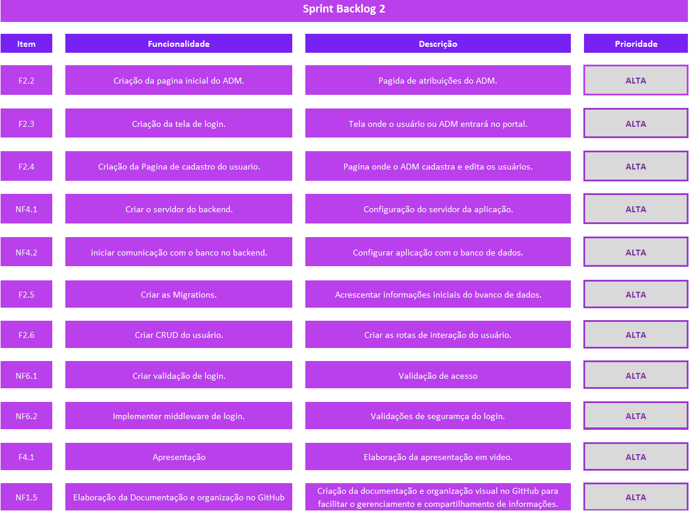
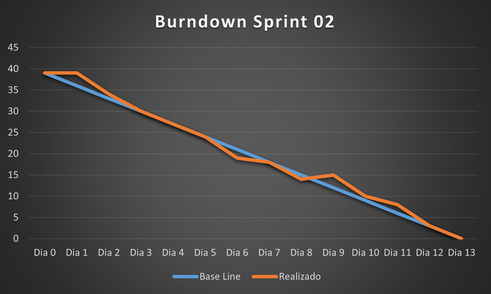
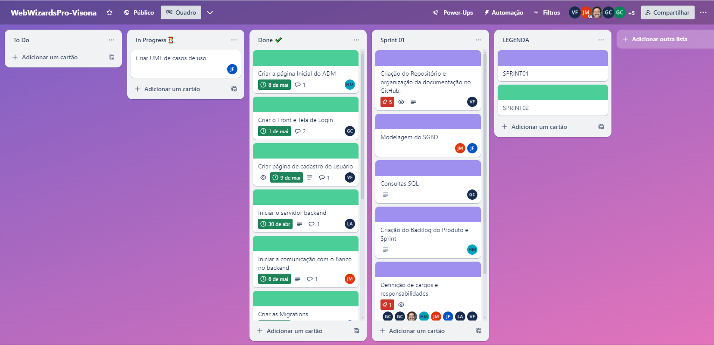

 

### 📍 Sprint 02 📍

## 🗓️ 18/04/2023 à 16/05/24 🗓️

 
<a  href="#dart-objetivo-da-sprint">Objetivo da Sprint</a> | 
<a  href="#sprint-backlog">Backlog da Sprint</a> | 
<a  href="#kanban">Kanban</a> | 
<a  href="#sprint-r">Sprint Review</a>

### 

#### [ 🏚️ Voltar para home](./README.md)

 
#  🤝 Objetivo da Sprint

- Nesta sprint, estamos construindo as partes básicas do sistema. Isso inclui criar as telas de entrada, como a página de login e a página inicial para o administrador, além de configurar o servidor e o banco de dados para que tudo funcione corretamente. Também estamos garantindo que a segurança do sistema esteja em ordem, com verificações de login e proteção de dados. E, para manter tudo organizado, estamos documentando o processo e organizando os arquivos no GitHub. 
 

# 🚧 Sprint Backlog

     

  
 
##### [🔝 Voltar ao topo ](#topo)
 
# 📇 Burndown Sprint 02
Nesta sprint o time se uniu para as entregas de cada item listado na backlog da sprint.

Abaixo se encontra o gráfico Burndown gerado pela equipe nesta sprint, onde o eixo X são os dias trabalhados e o eixo Y representa as entregas de cada dia:

    

##### [🔝 Voltar ao topo ](#topo)

# 📝 Kanban (Trello)

 

     
 

##### [🔝 Voltar ao topo ](#topo)

# 🎬 Sprint Review

##### [🔝 Voltar ao topo ](#topo)
